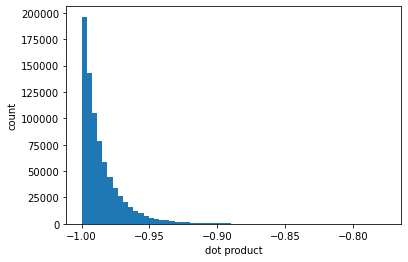

### An example of extending [oxdna_analysis_tools](https://github.com/sulcgroup/oxdna_analysis_tools)

The script in this folder is a well-commented example of how to write a custom analysis script using the tools found in [oxdna_analysis_tools](https://github.com/sulcgroup/oxdna_analysis_tools).  The script here reads in a trajectory file and calculates the distribution of the relative orientations between base-paired nucleotides.  The output of the script is a plot that looks something like this:

This script was used in parameterizing the base pair detection in oxView.
