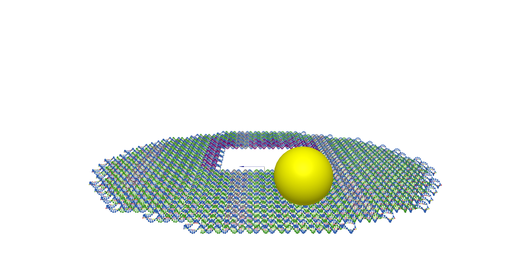

# Browser console scripting examples from a "small moon"

This example demonstrates how to use oxView's scripting interface to set up a simulation of orientation-controlled DNA structures as experimentally demonstrated in [this paper](https://science.sciencemag.org/content/371/6531/eabd6179).  It also demonstrates how to add additional objects to the scene, for example to show the location of a gold nanoparticle.

### Files
You need to download the following file to complete this example (GitHub does not like downloading individual files, to download you need to right click this link and select "Save Link As"):  
<a href="https://raw.githubusercontent.com/sulcgroup/oxdna-viewer/master/examples/5-scripting_example-death_star/death_star.oxview" download>death_star.oxview</a>

You will also need these two JavaScript scripts, however they can just be copy and pasted when you get to them in the example:  
<a href="https://raw.githubusercontent.com/sulcgroup/oxdna-viewer/master/examples/5-scripting_example-death_star/extend_5.js" download>extend_5.js</a>  
<a href="https://raw.githubusercontent.com/sulcgroup/oxdna-viewer/master/examples/5-scripting_example-death_star/add_AuNP.js" download>add_AuNP.js</a>

Or you can run this example from a pre-loaded file.  Click [here](https://sulcgroup.github.io/oxdna-viewer/?file=https://raw.githubusercontent.com/sulcgroup/oxdna-viewer/master/examples/5-scripting_example-death_star/death_star.oxview) to begin (you will still need the scripts).

### Protocol
1.  Load death_star.oxview into OxView.
2.  Open a JavaScript console. It is usually accessible through the browser menu or through a keyboard shortcut which varies by browser and operating system.
3.  Paste the script you would like to run into the opened console and press Enter. Please note that for some scripts (extend_5.js in this example), this can take a long time and you might get a notification from your browser that this tab is slowing down your browser. Don’t stop the page, let it complete.

### Output
After running extend_5.js, you should end up with a structure that looks like [this](https://sulcgroup.github.io/oxdna-viewer/?file=https://raw.githubusercontent.com/sulcgroup/oxdna-viewer/master/examples/5-scripting_example-death_star/extend_5.oxview).

After running add_AuNP.js, the scene will look something like this (Three objects are not saved in the oxview format): 

