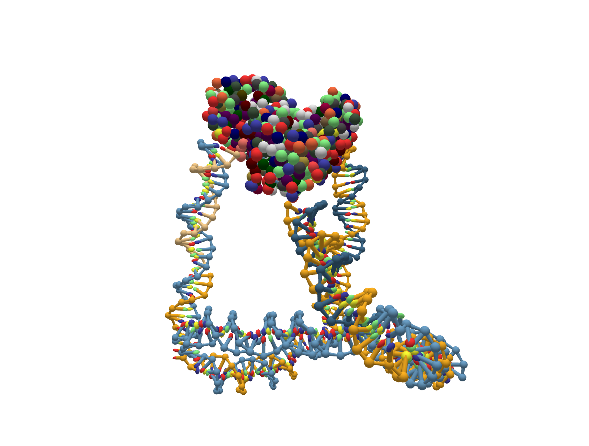

# Parameterizing a protein ANM in oxView

This example demonstrates how to use oxView to parameterize a DNA-protein hybrid using [ANM-oxDNA](https://github.com/sulcgroup/anm-oxdna).  The structure demonstrated here is a DNA tetrahedron scaffolded using KDPG aldolase as experimentally demonstrated in [this paper](https://pubs.acs.org/doi/10.1021/acsnano.8b09798)

### Files
You need to download the following files to complete this example (GitHub does not like downloading individual files, to download you need to right click these links and select "Save Link As"):  
<a href="https://raw.githubusercontent.com/sulcgroup/oxdna-viewer/master/examples/7-protein_example-tetrahedron/1eua.pdb" download>1eua.pdb</a>  
<a href="https://raw.githubusercontent.com/sulcgroup/oxdna-viewer/master/examples/7-protein_example-tetrahedron/dnacage.dnajson" download>dnacage.dnajson</a>  
<a href="https://raw.githubusercontent.com/sulcgroup/oxdna-viewer/master/examples/7-protein_example-tetrahedron/input_relax_MD" download>input_relax_MD</a>  
<a href="https://raw.githubusercontent.com/sulcgroup/oxdna-viewer/master/examples/7-protein_example-tetrahedron/input_run" download>input_run</a>  

### Protocol
1. Prepare the DNA component.  
   1. Select "Import" under the "File" tab. Choose the input file as the Tiamat design in dnajson format, file format as "tiamat", version as 2, Nucleic acid type as DNA and default base as random.
   2. Click Import and Load. The Tiamat design will be displayed in the viewer.  It should look something like [this](https://sulcgroup.github.io/oxdna-viewer/?configuration=https%3A%2F%2Fraw.githubusercontent.com%2Fsulcgroup%2Foxdna-viewer%2Fmaster%2Fexamples%2F7-protein_example-tetrahedron%2Fdnacage.dat&topology=https%3A%2F%2Fraw.githubusercontent.com%2Fsulcgroup%2Foxdna-viewer%2Fmaster%2Fexamples%2F7-protein_example-tetrahedron%2Fdnacage.top). 
   3. Go to "Dynamics" and select "Forces".  These strands are already base paired but stretched bonds need to be relaxed, so the forces should be relativley strong. Set "Stiffness" to 3.1 followed by "Create Forces from Basepairs" to generate forces to relax the DNA cage.
   4. Close the forces window by again selecting "Forces" under "Dynamics".
   5. Using oxServe (described in section B), launch an MC CPU job followed by an MD GPU job to relax the DNA cage.  The final structure should look something like [this](https://sulcgroup.github.io/oxdna-viewer/?configuration=https%3A%2F%2Fraw.githubusercontent.com%2Fsulcgroup%2Foxdna-viewer%2Fmaster%2Fexamples%2F7-protein_example-tetrahedron%2Frelaxedcage.dat&topology=https%3A%2F%2Fraw.githubusercontent.com%2Fsulcgroup%2Foxdna-viewer%2Fmaster%2Fexamples%2F7-protein_example-tetrahedron%2Fdnacage.top). Simulation is a stochastic process, so your structure will look different, but strands should not be frayed and there should be no stretched bonds.
   6. Save the system by selecting "Simulation Files" under "File" to download the topology and configuration of the relaxed structure.  It doesn’t need to be perfect now as we will need to relax it again after adding the protein component.
   7. Go to "File" and select "Forces" to save the forces we generated previously. We will need this file to relax the full system later. Go ahead and rename it to "dnaforces.txt"
   8. Refresh the window, then reload the system by dragging and dropping the topology and configuration files we just downloaded.
2.  Prepare the Protein component.
    1. Go to https://www.rcsb.org/ and download the desired protein (or the above link), in our case KDPG Aldolase (PDB ID:1EUA) in PDB format.
    2. Drag and drop the PDB file onto the oxView window to load the protein structure into the scene.  It will look like [this](https://sulcgroup.github.io/oxdna-viewer/?pdb=https%3A%2F%2Fraw.githubusercontent.com%2Fsulcgroup%2Foxdna-viewer%2Fmaster%2Fexamples%2F7-protein_example-tetrahedron%2F1eua.pdb&configuration=https%3A%2F%2Fraw.githubusercontent.com%2Fsulcgroup%2Foxdna-viewer%2Fmaster%2Fexamples%2F7-protein_example-tetrahedron%2Frelaxedcage.dat&topology=https%3A%2F%2Fraw.githubusercontent.com%2Fsulcgroup%2Foxdna-viewer%2Fmaster%2Fexamples%2F7-protein_example-tetrahedron%2Fdnacage.top) with the two structures.
    3. Select the protein. Go to the "Select" tab and select "System" in the top left corner. Now, click any amino acid to select the entire protein.
    4. Position the protein so it is not overlapping with the DNA cage. Use "T" and "R" (or Translate and Rotate underthe "Edit" tab) on the keyboard to switch between translation and rotation mode and position the protein awayfrom the DNA cage.
    5. Make an Anisotropic Network Model.
       1. With still only the protein selected, navigate to the "Protein" tab and select "Create Network". This initializes a network whose nodes are the selected particles and whose edges must be constructed.
       2. To construct the ANM edges we first define the cutoff distance, typically 12-18 Angstroms, in the box titled Edge Cutoff. After typing in 15 (Angstroms) into the "Edge Cutoff" box, we select "Assign Edges" and click "Cutoff (ANM)" in the submenu.
    6. Fitting the ANM to B-factor data.
       1. Open the flux solver by clicking "Fluctuation solver" in the top right corner of the "Protein" tab.
       2. Select "1eua bfactor" under Available Datasets.  This displays the B factor data of the "1eua.pdb" as the RMSF in Angstroms of each C-alpha particle in the protein.
       3. Set the temperature in the "temp" box to the temperature at which the B factor data was obtained. In our case we will set this to 190 K.
       4. Solve the network. By selecting "Network 1" under "Fitting Ready Networks", a web worker will be launched to fit our defined ANM to the PDB B factor data. This step can take some time depending on the system size and cutoff used. When it is finished it will generate a new dataset under Available Datasets titled "1eua Fit15A".
       5. View the B factors of the ANM. Select "1eua Fit 15A" under "Available Datasets" to see the B factors of the network on the graph.
       6. Save the parameterized ANM with the DNA cage. To save into a simulation-ready state, go to "File" and select "Simulation Files" to download the topology, configuration, and parameter files.  Please keep this oxView window open as we still need to define our forces.
3. Preparing Combined System.
   1. Find conjugated residues. In our experimental system, the protein was physically conjugated to the DNA cage at residue 52 Cysteine (N terminus to C terminus) in all three sites of the trimer protein with a lc-SPDP linker. This linker was previously simulated in fully atomistic resolution using GROMACS and approximated as a spring potential by matching the mean and standard deviation of the end-to-end length. With the protein in our viewer, open the browser console and type: `api.selectPDBIDS([52])` to select all residues with 52 as their PDB residue number. On KDPG Aldolase we see three cysteine residues selected. Either make a mental note of the positions of them or use the custom coloring feature in the View tab to highlight them.
   2. While holding ctrl, iteratively select each DNA nucleotide (the ids should be 97, 195 and 293) then the corresponding cysteine residue it’s physically linked to in experiment. Make sure the selection mode is "Monomer" inthe "Select" tab during this step.
   3. In the "Dynamics" tab select "Forces" and select "Create From Selection". Our forces are now displayed in the forces window.
   4. Download the forces file by clicking "Forces" under the "File" tab. Rename the file "linkerforces.txt".
   5. In "linkerforces.txt", find and replace the default r0 and stiffness values (1.2, 0.09) of each mutual trap to (1.071,1.424) match our linker approximation from [this paper](https://pubs.rsc.org/en/content/articlelanding/2021/sm/d0sm01639j).
   6. Delete the forces in the oxView window. In the forces window select the left top corner checkbox followed by selecting "Delete selected".
   7. Load the previous force file ’dnaforces.txt’. To ensure compatibility with the merged topology of the protein and DNA component, we must load in the forces we generated for the DNA component and export them for the merged topology.
   8. Download the forces file by selecting "Forces" under "File". Name it "relaxforces.txt".
4. Relax/Simulation of Hybrid System.
   1. Prepare combined forces file. Concatenate the the contents of the two forces files "relaxforces.txt" and "linker-forces.txt" into a new file names "allforces.txt" using either copy-and-pasting in text editors or using the command line.
   2. Prepare relaxation directory. Gather all force files and the generated topology, configuration, and parameter files from step 2(f)vi into one directory.
   3. Relax the system. Using either oxDNA directly or oxdna.org we first launch an MC job followed by a CUDA MD job to relax the structure using our "allforces.txt" force file.
   4. Simulate the system. Using just the "linkerforces.txt" as our external force file and the fully relaxed structure as the configuration file we can now simulate our fully formed hybrid DNA-protein structure. This simulation’s input file should have the following modifications from the standard input files:
   ```interaction_type = DNANM
   dt = 0.002
   external_forces = 1
   external_forces_file = linkerforces.txt
   ```
   We use the slightly lower dt for DNANM simulations as proteins tend to be much denser than DNA, so require slower simulation to avoid excluded volume clashes which can cause the simulation to explode.

   The final relaxed structure will look something like [this](https://sulcgroup.github.io/oxdna-viewer/?configuration=https%3A%2F%2Fraw.githubusercontent.com%2Fsulcgroup%2Foxdna-viewer%2Fmaster%2Fexamples%2F7-protein_example-tetrahedron%2Fcage.dat&topology=https%3A%2F%2Fraw.githubusercontent.com%2Fsulcgroup%2Foxdna-viewer%2Fmaster%2Fexamples%2F7-protein_example-tetrahedron%2Fcage.top&par=https%3A%2F%2Fraw.githubusercontent.com%2Fsulcgroup%2Foxdna-viewer%2Fmaster%2Fexamples%2F7-protein_example-tetrahedron%2Fcomb.par&force=https%3A%2F%2Fraw.githubusercontent.com%2Fsulcgroup%2Foxdna-viewer%2Fmaster%2Fexamples%2F7-protein_example-tetrahedron%2Flinker_forces.txt):
   
