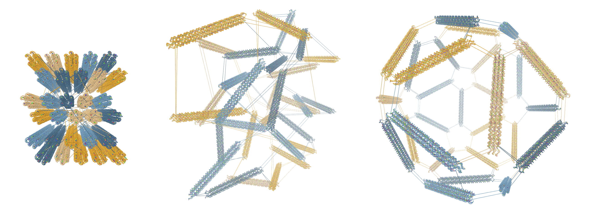

# Rigid-body relaxation example

## Instructions
This structure, consisting of three scaffolds, is very large and can take about 10 minutes to both cluster and relax. If you don't want to wait, you can:
 * Click [here](https://sulcgroup.github.io/oxdna-viewer/?configuration=examples%2Ficosahedron%2F7_icosahedron.json_post_dynamics.oxdna&topology=examples%2Ficosahedron%2F7_icosahedron.json.top) to directly load the relaxed end result.

If you still want to go through with the relaxation:

Either:
1. Click [here](https://sulcgroup.github.io/oxdna-viewer/?configuration=examples%2Ficosahedron%2F7_icosahedron.json.oxdna&topology=examples%2Ficosahedron%2F7_icosahedron.json.top) to load the non-relaxed configuration.

Or:
1. Use [tacoxDNA](http://tacoxdna.sissa.it/cadnano_oxDNA "tacoxDNA") to convert the caDNAno file `7_icosahedron.json` into the oxDNA file format (or simply use the converted files provided). 
2. Drag and drop the files `7_icosahedron.json.oxdna` and `7_icosahedron.json.top` together into the oxView window.

3.  Click on the "Cluster" options button () under the "Selection Mode" header in the sidebar.  Click "Start Clustering" to cluster with the default values.
4. Wait for the clustering to finish, this will take several minutes, depending on the speed of your computer. When the clustering is done, you will see each 6-helix bundle colored independently.
5. Check the "Rigid Cluster Dynamics" checkbox under edit tools in the sidebar and watch the clusters reorient themselves. This will also take a few minutes, depending on your computer. You may sometimes need to give the clusters a nudge manually, using the transform tool, but that is not necessary for this example.
6. When you are happy with the relaxation, uncheck the  "Rigid Cluster Dynamics" checkbox to stop the dynamics.

Note: unless you have moved the clusters manually while the dynamics were activated, you can undo/redo the changes back to the original configuration.

**Design source:**
- Douglas, Shawn M., et al.["Self-assembly of DNA into nanoscale three-dimensional shapes."](https://www.nature.com/articles/nature08016) *Nature* 459.7245 (2009): 414-418.
- Design file obtained from [Douglas Lab  github](https://github.com/douglaslab/cadnano-designs/blob/master/2009nature/7_icosahedron.json).
