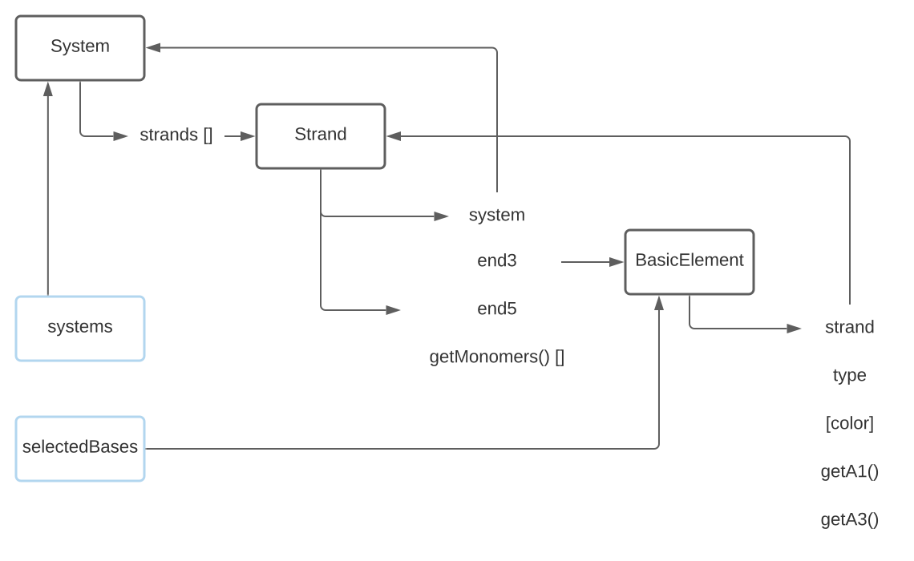

# oxView scripting introduction 
* press **F12** to open the **JS developers console** and paste the code examples following the instructions
## oxview data structure

* drag and drop  **TetA_F.oxview** to the scene or follow the [link](https://sulcgroup.github.io/oxdna-viewer/?file=https://raw.githubusercontent.com/sulcgroup/oxdna-viewer/master/examples/scripting_tutorial/TetA_F.oxview)
```js
//each loaded file gets a system
systems
//systems have strands
systems[0].strands
// those have either 3p or 5p endings and allow you to excess to monomers
systems[0].strands[0].end3
systems[0].strands[0].end5
systems[0].strands[0].getMonomers()[0] 
```

## working with selection on the scene

```js
//Selected strand length
let strands = new Set();
selectedBases.forEach(base=>strands.add(base.strand));
Array.from(strands).map(strand=>strand.getLength());
```
```js
//Select strands by length
clearSelection();
systems[0].strands.forEach(strand=>{
	if(strand.getLength()<40)
		api.selectElements(strand.getMonomers(),true);
}); 
// we have to update the scene to see the changes
render();
```

## dimer example 
* now drag and drop **TetB_F.oxview** to the scene 
* select by system and move one aside 
* you should see:


```js
// adjust the simulation box size
box.set(200,200,200);

// define our refference colors
const red = new THREE.Color("red");
const blue = new THREE.Color("blue");
// and lists of strands which we want to interconnect
let reds = [];
let blues = [];

//there are 2 systems present in our scene as we loaded up 2 files
systems.forEach(system =>
	// each of them has strands which we will color match
	system.strands.forEach(strand=>{
		if(strand.end3.color.equals(red))
			reds.push(strand);
		if(strand.end3.color.equals(blue))
			blues.push(strand);	
	}));

//by design the number of reds == number of blues
for(let i=0; i<reds.length;i++){
	//so pick one each
	let top = reds[i];		
	let bottom = blues[i];
	//and call the respective api call
	edit.interconnectDuplex3p(bottom, top, "GATTACA");
}
```
* resulting in:


* now you can use **RBD**
* and **oxServe** to relax the system.
* final [result](https://sulcgroup.github.io/oxdna-viewer/?file=https://raw.githubusercontent.com/sulcgroup/oxdna-viewer/master/examples/scripting_tutorial/tetDimerRelaxed.oxview)
 

